# automate-loadbalancer-configuration

In our last project we created a load balancer manually. In this project we will be automating our previous project https://github.com/BusisiwePieterson/Nginx-Loadbalancer using Shell scripting.

With shell scripting, we can write scripts to automate tasks such as installing software packages, configuring systems, setting up network connections, and managing files and directories. This reduces the manual effort required to perform these tasks, which in turn saves time and improves efficiency.

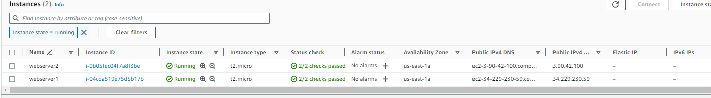

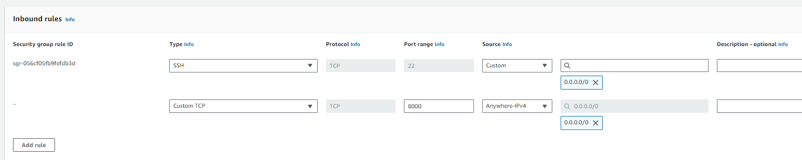

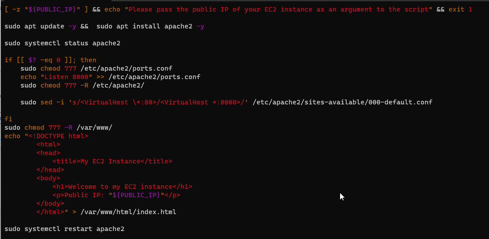

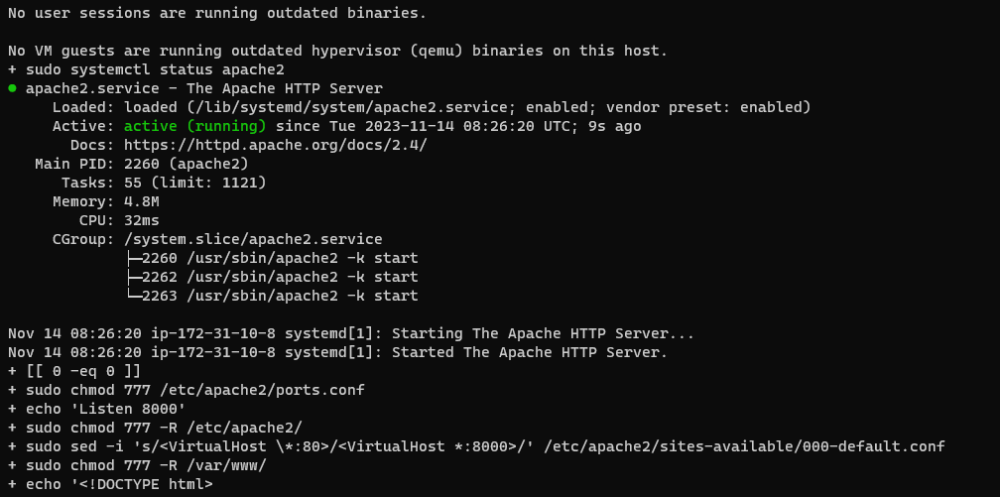

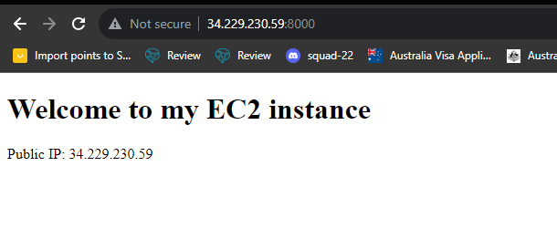

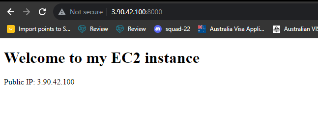

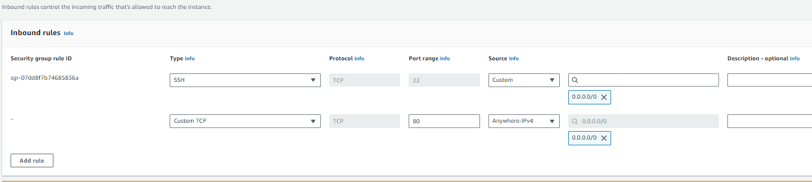

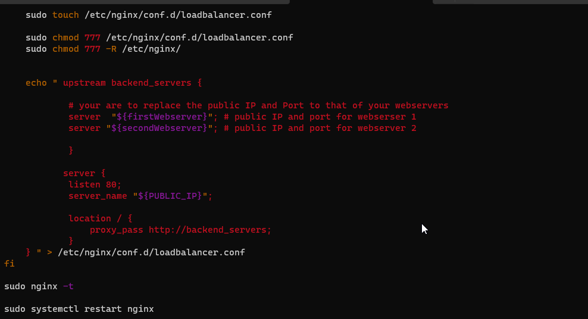

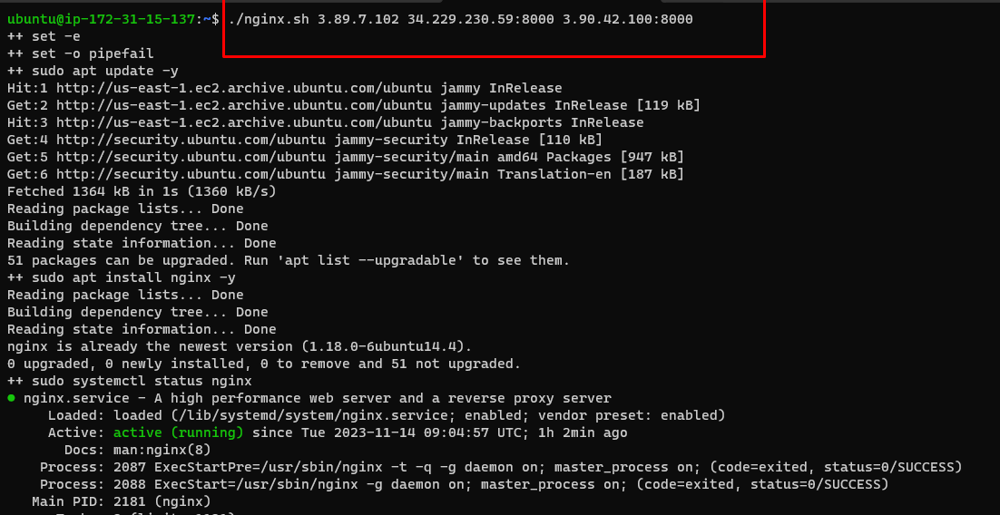

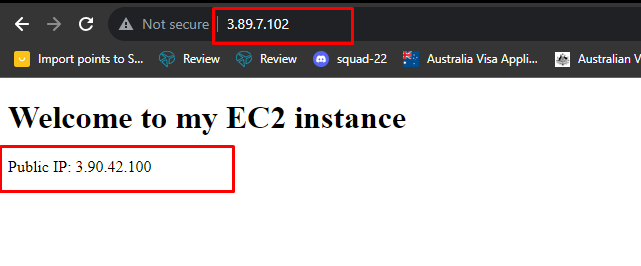

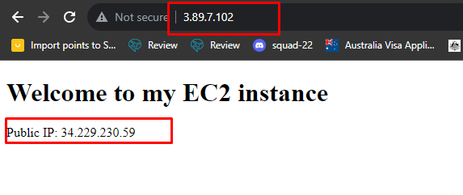